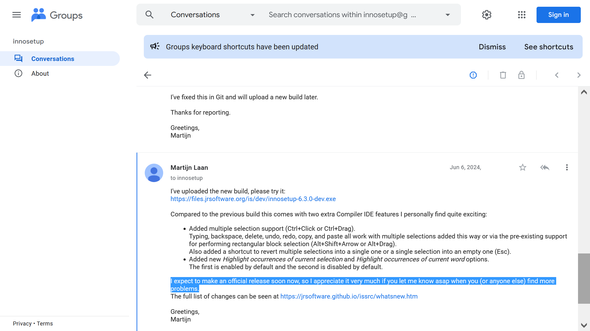
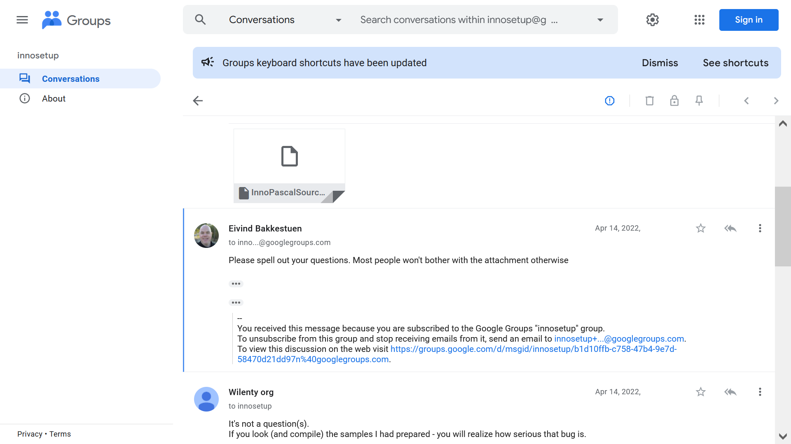

# Public message to InnoSetup owners (only): @jordanrussell & @martijnlaan (messages from other users will be deleted, and their accounts will be banned, because I'd like to avoid any pointless discussions)

https://github.com/jordanrussell please show real example how to get single Component/Task name directly from this class of pascal:<br><br>
`TNewCheckListBox->Items`<br><br>
for<br>
```
TWizardForm->ComponentsList
TWizardForm->TasksList
```
without any other function, for InnoSetup versions of:<br>
Inno Setup 6.3.3: https://github.com/jrsoftware/issrc/releases/tag/is-6_3_3<br>
and / or<br>
Inno Setup 6.4.0: https://github.com/jrsoftware/issrc/releases/tag/is-6_4_0<br>
because you wrote:<br>
`".Items" should work.`<br>
https://groups.google.com/g/innosetup/c/SPdiBzDnQ8w/m/pHuTRCeiBAAJ<br>
<br>
If you don't know I will tell you:<br>
no you can't get single Component/Task name from the `TNewCheckListBox->Items` class. I know because I already did it without any external tools and/or dlls, also without recompiling whole InnoSetup, even without asking anyone in the internet, or the official InnoSetup forum:<br>
https://github.com/Wilenty/VisualC-redist-installers-Demos<br>
*I only recompiled it to include the TGroupBox class, because even of many requests on official InnoSetup forum you not wiling to include it, but you were added the VclStyles classes that few people uses, but VclStyles classes significantly swelling installer base files.*<br>
So, it's a untrue and you even don't know how your product works at the client side.

https://github.com/martijnlaan<br>
`Please note that our request for commercial users to purchase a license applies regardless of version, so the statement above is not correct.`<br>
https://groups.google.com/g/innosetup/c/ZKOt0i4H3c8/m/WHITIgGRAgAJ<br>
<br>
So it's a "request", or isn't a "request"? You're forcing users who making any money by using InnoSetup to pay for all versions of InnoSetup, even Free versions shared before for absolutely Free as a DonationWare, to pay a License: "regardless of version". At the same time you deny that the previous versions were free: "so the statement above is not correct". So, you're trying to redefine the Free versions of already posted/shared InnoSetup releases that was absolutely Free.<br>
The law does not apply retroactively, but I see you think differently. So I will tell you something.<br>
Let's say you have an old gas-kitchen, you tried to sell it, but there is no interest in buying it. So you gave it to me for free, but in mean time I opened a street-food and I used your old gas-kitchen to make all of those eats. But after a year you're saying that I have to pay you 1000000€, because I used it to make money. That's your logic.<br>
So, following your line of reasoning, because you used my knowledge (and solution), shared to you for free, included in the InnoSetup to get money without my consent, please pay me for all past months, as well in the future months. I expect you to pay me just as you expect to be paid from others.

https://github.com/jrsoftware/issrc/blob/is-7_0_1/Projects/Src/Shared.LicenseFunc.pas#L256<br>
or<br>
https://github.com/jrsoftware/issrc/blob/main/Projects/Src/Shared.LicenseFunc.pas#L256<br>
and<br>
https://github.com/jrsoftware/issrc/blob/is-7_0_1/Projects/ISCC.dpr#L588<br>
or<br>
https://github.com/jrsoftware/issrc/blob/main/Projects/ISCC.dpr#L588<br>
and<br>
https://github.com/jrsoftware/issrc/blob/is-7_0_1/Projects/Src/IDE.MainForm.pas#L1544<br>
or<br>
https://github.com/jrsoftware/issrc/blob/main/Projects/Src/IDE.MainForm.pas#L1544

And what about InnoSetup forks, and other InnoSetup sources modifications, and above `All commercial users of Inno Setup are requested to purchase a commercial license.` on InnoSetup website and the line `    Result := 'Non-commercial use only';` in the Shared.LicenseFunc.pas#L256 file? <br>
Since I was unable to find any information regarding the licensing of forks and modifications of the InnoSetup program.<br>
So, if I modify InnoSetup source and compile it myself then commercial users have to pay to you, or I can change the license to completely free?

On the InnoSetup website quote: `Tiny footprint: only 1.78 MB overhead with all features included.`<br>
https://jrsoftware.org/isinfo.php<br>
<br>
Another untrue, because "empty installer" result size in the official InnoSetup 6.7.2 is: 1,99 MB (bytes: 2 096 171) for x86/32-bit; and with x64/64-bit loader ([Setup] UseSetupLdr=x64): 2,44 MB (bytes: 2 568 235); and based on "Example1.iss": 2,29 MB (bytes: 2 406 437) for x86/32-bit; and with x64/64-bit loader ([Setup] UseSetupLdr=x64): 2,74 MB (bytes: 2 878 501). But in the future version 7 of the InnoSetup base files will be even bigger.<br>
It's really so hard to update all information, if you already updated other information (including new installer screenshots)?

https://groups.google.com/g/innosetup/c/XRqmCxUtlE4<br>


So, untrue are allowed even from owners of the InnoSetup, but strict help with examples directly to the question provided by the post owner are not allowed on Official InnoSetup Forum. Here's a copy of my message/post that was deleted and my account banned. But messages out of the topic, or inappropriate messages like a "shooting in the foot" from your friends are allowed and they still remain untouched - you are fighting with the wrong person guys.<br>
You don't like me, because I know InnoSetup at the client side better than both of you, or what?

https://groups.google.com/g/innosetup/c/xa-DIDMxHnc/m/zQxhLbx2BQAJ<br>


I agree with Bill Stewart: <br>
`In general, the purpose of this group is for those who write Inno Setup installers to ask questions (and assist fellow Inno Setup developers) regarding Inno Setup itself.`<br>
and below discussion is also out of the topic, but it's from "forum friends", so its allowed. Better to make a real good clean in this Augean Stable called Official InnoSetup Forum, instead of deleting inconvenient messages.<br>
For example, question about changing window title of the InnoSetup graphical compiler: https://groups.google.com/g/innosetup/c/bTXePi3M8So/m/BApjunfiAQAJ<br>
but, answer suggesting about using InnoSetup command-line compiler instead: https://groups.google.com/g/innosetup/c/bTXePi3M8So/m/Zz_V0V4UAgAJ<br>
So, please answer where or what is the connection between those two posts/messages writing about two different programs?

https://groups.google.com/g/innosetup/c/y6d2wCdQT5o/m/elt2g9WgAQAJ<br>


I'll be kind for you, in contrary unlike you, who are fighting me. So please pay me $100 or 100€ for every past months to the time where I shared my knowledge with you to fix the bug of your program with icon overwrites. So please, pay me $100 or €100 for each month that has passed since I shared my knowledge with you to fix the bug in your programme that was overwriting icons. If you don't do this voluntarily, I will demand the full amount i.e. $1000 or €1000 for every of the past months instead of $100 or €100 of my kindness. And also please regular payments of $1000 or 1000€ on every future month starting from now on any of my support pages, because you are getting money by using my knowledge (and the solution), shared to you for free, and I didn't agree to use my solution to making money.

I have our email exchange regarding passing on my knowledge (and solution) to you on how to overwrite icons, so I can show it (publicly) if you wish.

You don't think just simply like a human being you should break the contract about the code, and ask all persons who shared their knowledge with you if they agree to use their solutions for making money by others?<br>
By the way, some of my works done in the InnoSetup have thousand lines of code, so it wouldn't be easy to move all of the works to another installer without wasting a lot of money and/or time.<br>
Dude, you changed the rules when people played your game - that's not OK, whatever you think about it.

I shared my knowledge to you only because InnoSetup was FREE for ALL. Maybe there are more people/persons like me, but they afraid to tell/write it publicly.

Take a look back at your work over the years:<br>
https://github.com/jrsoftware/issrc/blob/is-5_5_5/ishelp/isxclasses.pas#L116<br>
https://github.com/jrsoftware/issrc/blob/is-6_0_0/ISHelp/isxclasses.pas#L116<br>
https://github.com/jrsoftware/issrc/blob/is-6_0_5/ISHelp/isxclasses.pas#L116<br>
https://github.com/jrsoftware/issrc/blob/is-6_1_2/ISHelp/isxclasses.pas#L116<br>
https://github.com/jrsoftware/issrc/blob/is-6_2_2/ISHelp/isxclasses.pas#L116<br>
https://github.com/jrsoftware/issrc/blob/is-6_3_3/ISHelp/isxclasses.pas#L116<br>
https://github.com/jrsoftware/issrc/blob/is-6_7_2/ISHelp/isxclasses.pas#L144<br>
https://github.com/jrsoftware/issrc/blob/is-7_0_0/ISHelp/isxclasses.pas#L162<br>
https://github.com/jrsoftware/issrc/blob/main/ISHelp/isxclasses.pas#L162<br>
**TCanvas = class(TPersistent)**<br>
(...)<br>
`	property Pixels: Integer Integer Integer; read write;`<br>
So many eyes looking at the InnoSetup open source code, but your work still includes eyes-popping mistakes. It's only a example, there are more such simple and non-reported bugs.

Also, look at the other nonsense you wrote: <br>
`The blockage is to make it a little more difficult to write self installing malware installers using Inno Setup.`<br>
https://groups.google.com/g/innosetup/c/XRqmCxUtlE4/m/P-2oPhAPBQAJ<br>
<br>
What a total absurd would be to create `self installing malware installers using InnoSetup` like you wrote, if the InnoSetup base files are unnecessarily bloated? There is a program called NSIS that is much smaller, much more extensible, and far surpasses the functionality of InnoSetup, and has many and many free plugins created by the community, but much more difficult. So, "easy" not always equals "better".<br>
By the way, it's already made `self installing installers using InnoSetup` without the "malware" word from your quote. Download below example, look at the *.cmd files and use it:<br>
https://github.com/Wilenty/VisualC-redist-installers-Demos/releases<br>
So it's possible to create the `self installing installers using InnoSetup`, in any version of InnoSetup. Above command-line parameters change behaviour of the whole installer, so it would be `self installing installers using InnoSetup` without any command-line parameters, if I wanted to.<br>
I will repeat it again, I don't need to recompile whole InnoSetup for create `self installing installers using InnoSetup` (without the "malware" word).<br>
*But, maybe did you mean the "self copying malware installers using InnoSetup"? Same as before - base files are too big to be a usable malware or virus made in the official InnoSetup.*<br>
So, you are looking for a hole without a hole.

https://groups.google.com/g/innosetup/c/fNDrkcdJnHg/m/MurZ2uilAAAJ<br>


A while ago, you asked us to report any issues we found (as soon as possible), but when do you intend to fix this critical bug that I reported on your forum back in 2022?

Here is simple-as-possible example: https://github.com/Wilenty/issrc/blob/main/InnoSetupBugs/4.iss



### In summary

1. I shared my knowledge (and solution) for free to fix the issue with icons being overwritten, simply because InnoSetup was available to everyone for free at the time.<br>
2. I don’t agree with you using my knowledge (and solution) I’ve shared with you for free to make money – you should either share your work for free or pay me for my contribution, given that you yourself expect to be paid for your work.<br>
3. Please pay $100 or €100 for each past month in which you have benefited from my knowledge (and my solution). If you do not do so voluntarily, I will demand the full amount, i.e. $1,000 or €1,000 for each of the past months.<br>
4. Please pay me $1000 or 1000€ in every future month from now on, because you are sharing InnoSetup for money, and forcing companies to pay for a license, because you're getting money using my knowledge shared to you for Free, without my consent.<br>
5. When do you intend to fix this serious bug in InnoSetup, which I reported on your forum in 2022?  Look also at the: https://github.com/Wilenty/issrc/raw/refs/heads/main/InnoSetupBugs/Puzzling%20operation%20of%20InnoSetup.7z<br>
6. Please compile it without the "PS_MINIVCL" constant/variable to include already existing TGroupBox/TRadioGroup/etc. classes you were asked many times, even on your forum. You’ve added another external VclStyles classes (that cause the base program files to become unnecessarily bloated, that are rarely used), but still you didn't include already existing classes you were asked.<br>
7. I will think to publish more InnoSetup bugs when I have overdue payments on my account and you will fix critical bug mentioned above.

Don't you think the whole sources of the InnoSetup should be deeply reviewed, instead of making partially changes like a painting the wall with a buckets of various paints?

<br>
Sorry, but where have you been for the last (about) 15 years?<br>
https://github.com/jrsoftware/issrc/blob/main/license.txt#L8

Greetings,<br>
Wilenty

P.S.<br>
I’m writing this here so that you can’t (easily) delete my message, and I know you’ll receive notifications about my message to you.<br>
